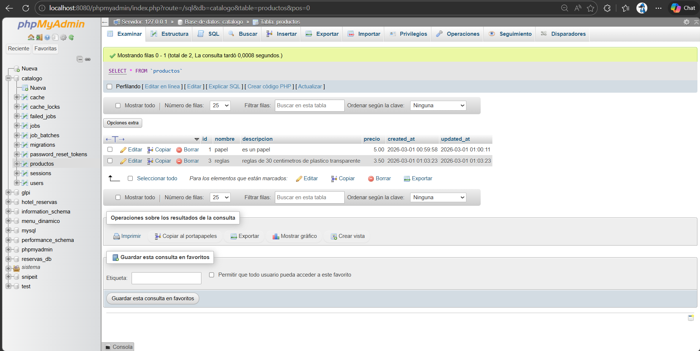
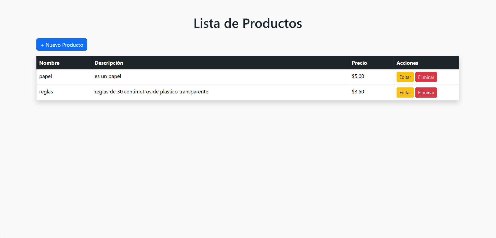
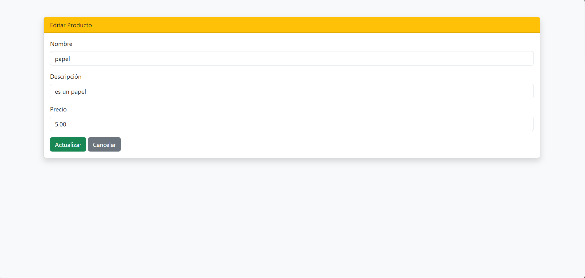

# 📦 Catálogo de Productos - Laravel

## 🎯 Descripción
Aplicación CRUD desarrollada en Laravel utilizando arquitectura MVC.

Permite:
- Crear productos
- Listar productos
- Editar productos
- Eliminar productos

---

## 🛠 Requisitos Previos

- PHP 8+
- Composer
- MySQL
- Laravel 10+

---

## 🚀 Instalación

1. Clonar repositorio

git clone URL_DEL_REPOSITORIO

2. Entrar al proyecto

cd catalogo

3. Instalar dependencias

composer install

4. Configurar archivo .env

Copiar el archivo:

cp .env.example .env

Configurar base de datos en .env

5. Generar clave

php artisan key:generate

6. Ejecutar migraciones

php artisan migrate

7. Levantar servidor

php artisan serve

8. Usar la siguiente url para probar
http://127.0.0.1:8000/productos
---

## 📷 Evidencia

Adjunto evidencia de la base de datos y del crud funcional 

Crud funcional

## 👨‍💻 Autor
Nicolas Altamirano 